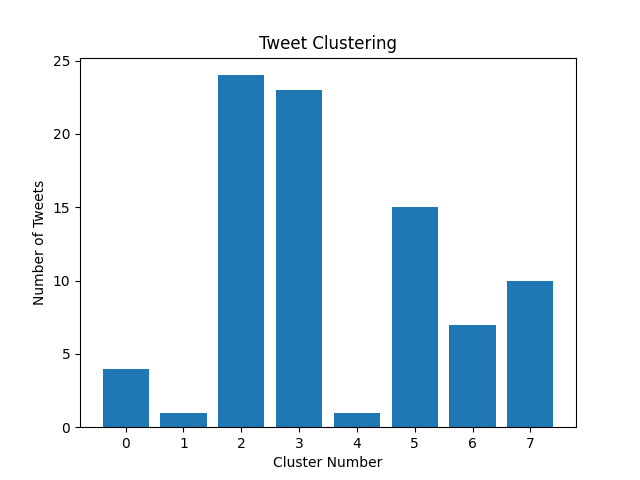

## Network based Social Media Analytics
##### Dominic Houston-Watt - 2253422h
##### [GitHub Link (Source & Sample Data)](https://github.com/DominicHW/WebScience)

### Introduction
The aim of this project was to develop a Twitter crawler for data collection, and to perform analytics on the collected tweets. This report will cover the tasks outlined in the assessment document, and where appropriate will provide visuals to aid description. The software developed collects tweets (based off a specific keyword) through Twitters Stream and REST API's, storing them in a local MongoDB database. From there, tweets were exported in JSON format for cluster processing, and then processed to gather username and hashtag identification. Using this gathered information, a user interaction graph could be built to show the link between tweets and users. Finally there is some network analysis information which looks into the links & triads of data and how they contrast to the standard clustered information.

For the purpose of sample data, a few hundred tweets were gathered using the crawler. The reason for this is that once the number of tweets increases, the interaction graphs become much harder to read as all the nodes and links are layered or closer togeher.

As the crawler stores information to a local database, the sample data was exported as a JSON file so that whoever runs the application doesn't need to setup the MongoDB on the port used during this assignment.

### Data Crawl
To collect tweet information from Twitter, the Streaming API provided by Twitter was used to collect 1% of tweet information over a period of time. The purpose of using the Stream API was to collect real-time data concerning a certain topic or sourcing from a particular user. Due to the current epidemic (March 2020), the keyword "corona" was used to gather tweets as this would have the highest output of tweets in a smaller space of time. This proved extremely useful, as of *20/03/2020 10:00pm* there was an output (and writing to the database) of 10 tweets per second provided by the crawler. As this captures only 1% of data, this means that at the current time there is a tweet rate of 1000 tweets per second filtered in the English language (setting a filter on collection to contain tweets with language set to 'en').

To enhance the crawler, a hybrid architecture was implemented which incorporated the Stream API mentioned above with Twitter's REST API to collect more tweets. The REST API sets a restriction on tweet collection at 50 tweets per call, and can only be called once every 15 mins. Creating this hybrid architecture is beneficial as it allows more (even if limited) tweets to be collected regarding a certain topic

### Tweet Clustering
The next step of the analysis process was to perform clustering. Using the database of collected tweets, the idea is to perform grouping (clustering) of tweets based on semantic value of the entire tweet. This was performed using *k*-means clustering, a method of vector quantization, by averaging the sum of each tweet (each word is given a semantic integer value) and grouping tweets based on the closeness of their mean value. The algorithm used is an off-the-shelf application available to the public to use, slightly altered to output information that is useful for the assignment.

Prior to clustering, each of the tweets are cleaned using a regular expression statement. This removes unneccessary symbols that have no semantic value, thus allowing a better mean value for each tweet to be calculated. To initialise the clusters, cluster *seeds* are needed. Using `initialize_seeds.py`, clusters are initialised with random tweets (the number of clusters is entered by the user, however for the purpose of the exercise the number of clusters is 10% of the number of tweets stored). Each tweet is tokenized and clustered, where each tweet assigned to a cluster is gathered into a list. The screenshot below shows the clustering performed on a small subset of the gathered tweets.

Fig 1: Cluster count per cluster (set of 8)
&nbsp

| Total Number of Tweets | Max Cluster Size | Min Cluster Size | Average Cluster Size |
| ---------------------- | ---------------- | ---------------- | -------------------- |
| 85                     | 24               | 1                | 10                   |

### User & Hashtag Information
Through the collection of tweets, the user's Twitter ID can be captured (for qualitative information, usernames and names can also be obtained). Using this ID, we can search through replies and retweets of different tweets to build a graph of user interaction. In the previous section, tweets were grouped together based on the semantic value of the tweet, however it is also possible to group based on the number of interactions between users.

Taking the interaction information between users, a graph can be built which illustrates the interactions and provides insight into who are the most "active" or "influencial" users, where each ingoing edge increases the size of the user node. Different networks exist for different interactions between users, for example there exists a retweet network, a quote/reply network and general tweet network (the one collected in part 1).

As well as grouping by users, tweets can be organised by occurence of hashtags. This provides insightful context to what topics are being discussed within a certain network of tweets. To do this, you can take the clusters generated in the previous section, iterate through all the tweets and count the occurences of individual hashtags.

The networks generated from this won't be directed, as only co-occurence information is collected, however the number of connections to each node still provides valuable analysis information.
